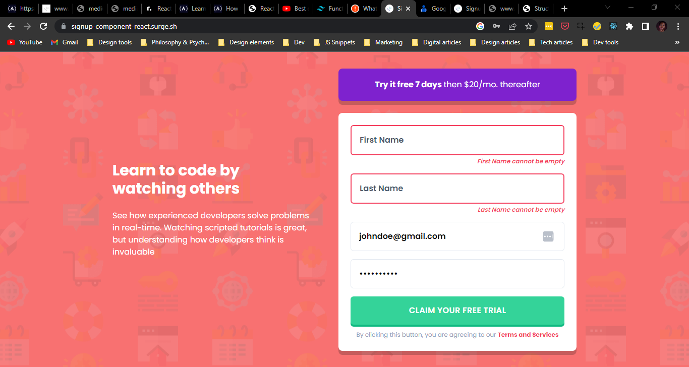

# Frontend Mentor - Intro component with sign up form solution

This is a solution to the [Intro component with sign up form challenge on Frontend Mentor](https://www.frontendmentor.io/challenges/intro-component-with-signup-form-5cf91bd49edda32581d28fd1). Frontend Mentor challenges help you improve your coding skills by building realistic projects.

## Table of contents

-   [Overview](#overview)
    -   [The challenge](#the-challenge)
    -   [Screenshot](#screenshot)
    -   [Links](#links)
-   [My process](#my-process)
    -   [Built with](#built-with)
    -   [What I learned](#what-i-learned)
    -   [Continued development](#continued-development)
-   [Author](#author)

## Overview

I built a signup form component that validates a user's input and shows errors if they submit an invalid form. It was built using ReactJS(create-react-app) and TailwindCSS

### The challenge

Users should be able to:

-   View the optimal layout for the site depending on their device's screen size
-   See hover states for all interactive elements on the page
-   Receive an error message when the `form` is submitted if:
    -   Any `input` field is empty. The message for this error should say _"[Field Name] cannot be empty"_
    -   The email address is not formatted correctly (i.e. a correct email address should have this structure: `name@host.tld`). The message for this error should say _"Looks like this is not an email"_

### Screenshot

### Links

-   Solution URL: [Github](https://github.com/Jeffreyon/intro-component-with-signup-form)
-   Live Site URL: [Deployed on Surge](https://signup-component-react.surge.sh/)

## My process

I chose to build this project because i wanted to try something interactive rather than static components.

Started off with unstyled React components so i could focus on how data flowed. Initially i wanted each input field to keep it's own state, but it got too complex quickly so i kept every state and functionality in the form itself and passed them as props to the input fields

After testing the first input box (for first name), i turned it into a generic component where i can pass input attributes as props. I used refs to get access to the input's value but passing refs as a prop is not allowed in react, except when passed with `React.forwardRef()`. It was the first time i used that functionality

Once i had the components setup and working, i got to styling it and I chose TailwindCSS for their utilities based library. Their default design system had everything i needed. No stress.

When the form gets submitted, it calls a function passed as a prop from the `App` parent component. That way i can do something when a valid form gets submitted (like log the user in)

After that i deployed the site using surge.sh, here's a [link to the project](https://signup-component-react.surge.sh/)

### Built with

-   Semantic HTML5 markup
-   CSS custom properties
-   Flexbox
-   Mobile-first workflow
-   [React](https://reactjs.org/) - JS library
-   [TailwindCSS](https://tailwindcss.com) - CSS library
-   [Surge](https://surge.sh) - Static site server

### What I learned

-   Learnt how to use `React.forwardRef()`
-   Learnt how to setup and use tailwind for a React project including optimizing for production
-   Learnt how to use Tailwind's `@apply` directive so that i can use tailwind's classes in my custom styles without hardcoding those values

### Continued development

I would like to learn how to customize Tailwind further. While the build looks close to the proposed design, i didn't nail it as much as i wanted to. Until i start using sass.

## Author

-   Website - [Jeffrey Onuigbo](https://www.github.com/Jeffreyon)
-   Frontend Mentor - [@jeffreyon](https://www.frontendmentor.io/profile/Jeffreyon)
-   Twitter - [@jeffreyon\_](https://www.twitter.com/jeffreyon_)
